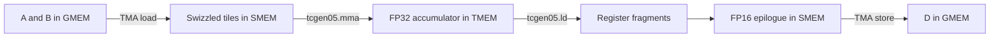

<style>
  #markdown-content img[src*="/assets/img/tirx-gemm/"] {
    display: block;
    width: auto;
    max-width: min(100%, 980px);
    max-height: 78vh;
    height: auto;
    margin: 1.5rem auto;
    object-fit: contain;
  }
</style>

> **The matrix multiplication never changed. The way the GPU was orchestrated did.**

How much control can a Python DSL give us without giving up GPU performance?

I reproduced a nine-stage GEMM optimization journey in TIRx on an NVIDIA B200. On the directly comparable `4096³` FP16 workload, throughput increased from **266.9 TFLOP/s** in V3 to **1,263.9 TFLOP/s** in V9. The cuBLAS reference through `torch.mm` reached **1,291.6 TFLOP/s**.

So the final TIRx kernel reached **97.9% of cuBLAS throughput** for this particular shape, dtype, GPU, and software environment.


> **The short version**
> - Hardware: one NVIDIA B200
> - Operation: `D = A @ B.T`
> - V3-V9 shape: `M=N=K=4096`
> - Inputs and output: FP16
> - Accumulation: FP32 in Blackwell Tensor Memory
> - V3: 266.9 TFLOP/s
> - V9: 1,263.9 TFLOP/s
> - cuBLAS: 1,291.6 TFLOP/s
{: .block-tip }

The first kernel was deliberately safe and correct: load one tile, issue one matrix multiply, copy the result back. Then one systems idea was added at a time. What changed was data movement, overlap, work assignment, synchronization, and reuse.

# Why TIRx?

DeepSeek made low-level GPU kernel optimization part of the broader AI conversation. But do we need to write CUDA or PTX by hand to work at this level?

TIRx offers an interesting middle ground. It is a Python-embedded DSL in TVM, but it does not hide the hardware model. A kernel still describes shared-memory layouts, TMA transfers, barriers, Tensor Core dispatch, TMEM allocation, CTA clusters, and warp roles.

For example, the Python code can explicitly say:

```python
A_layout = tma_shared_layout(
    a_type,
    SwizzleMode.SWIZZLE_128B_ATOM,
    (BLK_M, BLK_K),
)

Tx.copy_async(Asmem[:, :], A[...], dispatch="tma")

Tx.gemm_async(
    tmem[:, :],
    Asmem[:, :],
    Bsmem[:, :],
    accum=True,
    dispatch="tcgen05",
    cta_group=2,
)
```

TIRx lowers this through TVM into generated CUDA and architecture-specific operations such as TMA, `mbarrier`, and `tcgen05`.

So “Python syntax” does NOT mean automatic optimization. The syntax is Python, but the responsibilities are still those of a kernel engineer. Layout, synchronization, pipeline depth, memory lifetime, and work partition must all be correct.

That is exactly what made it useful to learn.

# The Blackwell path, in one picture

For this GEMM, A and B normally travel through global memory and shared memory before the Tensor Core consumes them. Blackwell changes the accumulator path: `tcgen05.mma` writes the long-lived FP32 accumulator into Tensor Memory, or TMEM, instead of keeping it in ordinary registers.



A few execution scopes appear in the same kernel:

- One selected thread can issue a TMA transfer.
- One elected thread can submit a `tcgen05` MMA.
- A 128-thread warpgroup cooperates when loading TMEM fragments for the epilogue.
- Two CTAs can cooperate on one larger MMA tile in a cluster.

It is important to see that a fast kernel is a coordination system around the Tensor Core. The Tensor Core may perform the arithmetic, but it can only run when the right bytes are in the right memory layout and all dependencies are satisfied.

# Nine kernels, three acts


| Version | Main change | Shape | TFLOP/s |
| --- | --- | --- | --- |
| V1 | Sequential single tile | 128 × 128 × 64 | 0.41 |
| V2 | K-loop accumulation | 128 × 128 × 4096 | 2.70 |
| V3 | Spatial tiling | 4096³ | 266.92 |
| V4 | TMA asynchronous movement | 4096³ | 274.66 |
| V5 | Two-stage software pipeline | 4096³ | 521.29 |
| V6 | Persistent tile scheduler | 4096³ | 611.12 |
| V7 | Warp specialization | 4096³ | 599.94 |
| V8 | Two-CTA cluster | 4096³ | 1,153.76 |
| V9 | Two MMA consumers | 4096³ | 1,263.87 |
| cuBLAS | `torch.mm` reference | 4096³ | 1,291.62 |

> **Comparison note:** V1 and V2 use their native teaching shapes, so their latency and TFLOP/s are not directly comparable with V3-V9. The meaningful full-matrix journey starts at V3.
{: .block-warning }

## Act I: Make it correct, then make it cover the problem

### V1: One tile, one path

V1 computes one `128 × 128 × 64` problem. All 128 threads synchronously copy A and B from GMEM to SMEM. One elected thread submits the Blackwell MMA. The FP32 result accumulates in TMEM, then a warpgroup loads it into registers and writes FP16 output back to GMEM.

This version is not fast and just to make the computation correct. Its job is to expose the complete path:

```text
GMEM -> SMEM -> tcgen05 -> TMEM -> registers -> GMEM
```

The first useful lesson was that TMEM does not store A and B in this kernel. It stores the accumulator. A and B remain staged in SMEM and are consumed directly by `tcgen05`.

### V2: Add the K-loop

A real GEMM usually has a K dimension larger than one hardware tile. V2 loops over K in chunks of 64 and accumulates every partial product into the same TMEM region.

The main difficulty is not the loop itself. It is completion tracking. The MMA is asynchronous, and the same barrier is reused. The software phase must flip after every iteration; otherwise a later wait can observe completion from the previous MMA and pass too early.

### V3: Tile M and N across CTAs

V3 extends the kernel from one output tile to the full `4096 × 4096` output. With `BLK_M=BLK_N=128`, the grid contains:

```text
32 × 32 = 1,024 output tiles
```

Each CTA owns one `128 × 128` output tile. The GPU runs those logical CTAs in waves across its SMs.

This is the first version directly comparable with the later kernels. It reaches **266.9 TFLOP/s**. The kernel now has enough parallel work, but each CTA still performs load, compute, and writeback in a sequential way.

## Act II: Stop making the Tensor Core wait

### V4: Let TMA move the tiles

V4 replaces thread-by-thread operand movement with the Tensor Memory Accelerator (TMA).

One thread describes and launches a rectangular GMEM-to-SMEM copy. The TMA hardware performs the transfer and signals an `mbarrier` after the registered byte count has landed.

Throughput moves only from **266.9 to 274.7 TFLOP/s**.

This small improvement is important. Async movement by itself is NOT overlap. If the kernel immediately waits for the transfer, the hardware mechanism is better, but the schedule is still mostly serial.

### V5: Add a two-stage software pipeline using double buffer

V5 introduces two SMEM stages:

```text
Stage 0: k0 -> k2 -> k4 ...
Stage 1: k1 -> k3 -> k5 ...
```

While MMA consumes one K tile, TMA can fill the other stage with the next tile. Each stage has its own completion barrier so the consumer knows exactly which buffer is ready.

This is the first large jump:

```text
V4: 274.7 TFLOP/s
V5: 521.3 TFLOP/s
```

Almost 2× came from overlapping movement with compute, not from changing the matrix multiplication.

### V6: Keep CTAs alive

V5 launches one CTA for every output tile. For this shape, that means 1,024 CTAs. Every CTA initializes barriers, allocates TMEM, computes one tile, and exits.

V6 launches 148 persistent CTAs, matching the B200 SM count used by this experiment. Each CTA repeatedly asks a tile scheduler for another output tile:

```text
setup -> tile 0 -> tile 1 -> tile 2 -> ... -> exit
```

On average, each persistent CTA processes about `1024 / 148 = 6.9` tiles. Setup is amortized, and nearby tile scheduling can improve L2 locality.

Throughput rises again to **611.1 TFLOP/s**.

This is a useful AI infrastructure pattern beyond GEMM: sometimes the problem is not how quickly one task runs, but how much repeated setup and scheduling overhead exists around a long stream of tasks.

## Act III: Specialize the workers and share more data

### V7: Warp specialization, with a small regression

V7 assigns different roles to different warps:

- TMA producer: keeps filling SMEM stages.
- MMA consumer: submits Tensor Core work as soon as operands are ready.
- Writeback warpgroup: moves completed accumulators from TMEM to GMEM.

Four barriers define ownership of SMEM and TMEM:

```text
tma2mma: operands are ready
mma2tma: SMEM stage is reusable
mma2ld: TMEM accumulator is ready
ld2mma: TMEM range is reusable
```

This structure allows load, MMA, and writeback to advance independently. It is also require more careful design. A wrong initial phase can deadlock the pipeline; an early arrival can allow one actor to overwrite a buffer still owned by another.

And the measured result is interesting:

```text
V6: 611.1 TFLOP/s
V7: 599.9 TFLOP/s
```

V7 is slightly slower.

I am not sure about the exact reason for this (probably profiling can tell more). Warp specialization creates the possibility of overlap, but it also consumes more threads, barriers, SMEM, and scheduling machinery. With a pipeline depth of two, the additional structure did not pay for itself in this benchmark.

### V8: Two CTAs cooperate on one larger tile

V8 forms a two-CTA cluster. Each CTA owns separate SMEM and TMEM, but the cluster can synchronize and access peer SMEM.

The two CTAs jointly compute a `256 × 256` logical output tile:

```text
CTA 0 TMEM: first 128 output rows × 256 columns
CTA 1 TMEM: next 128 output rows × 256 columns
```

There is no single shared TMEM buffer. The logical result is distributed across the two local TMEM allocations.

The cluster design nearly doubles throughput:

```text
V7: 599.9 TFLOP/s
V8: 1,153.8 TFLOP/s
```

This was the biggest architectural jump in the full-size journey. The kernel now matches the natural granularity of Blackwell's cooperative Tensor Core path much better.

### V9: Two consumers reuse the same B tile

V9 adds a second MMA consumer. The consumers process different A rows but share the same staged B tile:

```text
Consumer 0: A0 @ B.T
Consumer 1: A1 @ B.T
```

The cluster output grows from `256 × 256` to `512 × 256`. B is loaded once per stage and participates in two cooperative MMAs. This method is taking advantage of L2-cache of the Blackwell architecture to save more frequently used variables. The two accumulators occupy separate TMEM column ranges, and each has its own completion and writeback path.

Throughput reaches **1,263.9 TFLOP/s**, or **97.9% of the cuBLAS reference**.

The last gain did not come from moving B faster, but came from getting more useful compute from the B tile that was already staged.

# What the timing actually measured


The complete result bundle and benchmark scripts live in the [experiment repository](https://github.com/jq-wei/LLM/tree/main/cuda/tirx/gemm).

# GPU activity is not Tensor Core utilization


The activity chart uses NVML signals similar to what `nvidia-smi` exposes: coarse GPU active percentage, memory-controller activity, power, and clocks.

GPU utilization is very different from whether the Tensor Core pipeline is efficient. Most full-size kernels already report close to 100% GPU active. Yet their throughput differs by almost 5×. A kernel can be active while waiting on barriers, performing address work, or moving data.

# Take away

## 1. High-performance GEMM is an orchestration problem

The arithmetic is fixed. Performance comes from arranging the surrounding system so the Tensor Core rarely waits:

```text
load early
signal exactly
reuse safely
compute continuously
write back without blocking the next tile
```

## 2. Asynchronous does not automatically mean overlapped

V4 introduced TMA but gained only a little. V5 reorganized the schedule so transfer and compute could genuinely overlap, and throughput almost doubled.

## 3. Every optimization spends a resource

Deeper pipelines consume SMEM. More warp roles consume threads and synchronization state. Larger tiles can improve reuse but increase register, TMEM, and writeback pressure.

The V7 regression is a concrete reminder that optimization direction is a trade.

## 4. Python can expose low-level control, but it does not remove low-level reasoning

TIRx is much easier to compose and inspect than handwritten PTX. At the same time, it still exposes the concepts that decide performance: swizzled SMEM layouts, execution scope, transaction barriers, TMEM ownership, CTA clusters, and hardware dispatch.

# References

- [Modern GPU Programming for MLSys: GEMM basics](https://mlc.ai/modern-gpu-programming-for-mlsys/chapter_gemm_basics/)
- [Modern GPU Programming for MLSys: Async GEMM](https://mlc.ai/modern-gpu-programming-for-mlsys/chapter_gemm_async/)
- [Modern GPU Programming for MLSys: Advanced GEMM](https://mlc.ai/modern-gpu-programming-for-mlsys/chapter_gemm_advanced/)
- [Apache TVM TIRx overview](https://tvm.apache.org/docs/tirx/overview.html)

# Detailed technical notes

The page below keeps the longer notes: execution hierarchy, TMEM, TMA, `tcgen05`, barrier phases, clusters, and the line-by-line discussion of all nine kernels.

[TIRx GEMM - Detailed Technical Notes]()

